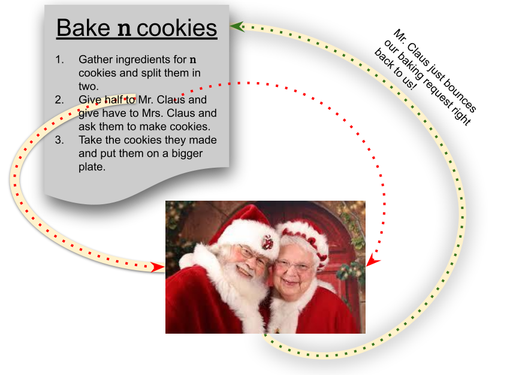
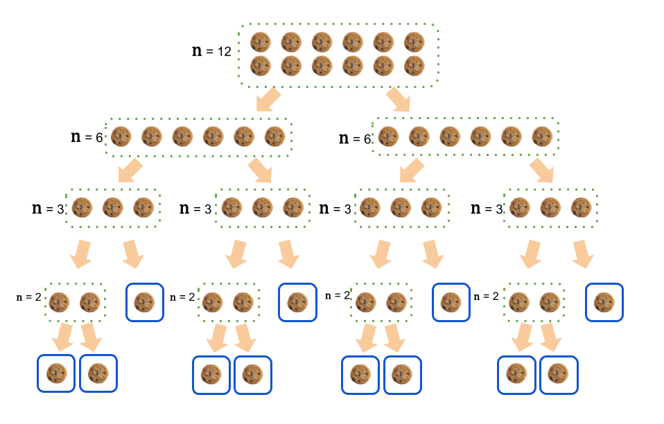
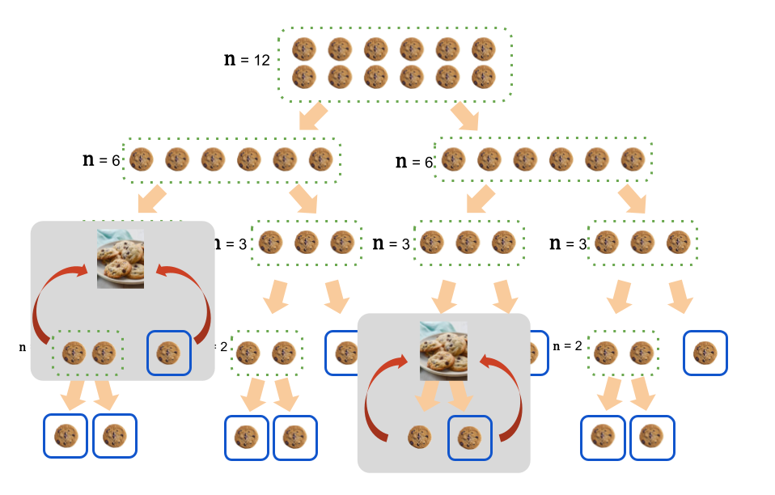

# When You Say Nothing At All

As algorithm designers[^designers], we are intimately familiar with solving problems using iterative methods. An algorithm that solves a computational problem iteratively (or _incrementally_) is one that processes elements of input sequentially.

[^designers]: Remember that in this class we are alternatively designing _and_ analyzing algorithms. To start off, in this algorhythm you will be designing algorithms. We will switch to analysis soon enough.

We have discussed in class how it might be possible to imagine or create new algorithms if we think about the computational problem in terms of invariants -- facts that must be true about the state of the construction of the solution to the computational problem at given places in the algorithm. If the invariant is properly stated and it holds (i.e., it is true) at the time of the algorithm's termination, that could be what we need to _prove_ the correctness of our algorithm.

For example, in insertion sort, the invariant was that there existed some $j$, an index into the list of elements to sort, and all the elements in the list between index $0$ and index $j$ were in sorted order. Because $j$ was an index into the last element of the list at the time the insertion sort algorithm terminated, we used our invariant to prove that the algorithm yielded a sorted list. Very cool!

We doubled-down on the power of using invariants like the one in insertion sort. We said that we could use them to design an algorithm for any computational problem according to the following algorithm:

1. Consider the _next_ element of the input.
2. Move that element of the input into a position that violates the invariant.
3. Follow the steps necessary to restore the invariant.
4. If there are no more elements of the input to consider, then the algorithm terminates.
5. Otherwise, return to Step (1).

Steps (1) - (5) form an iterative/incremental algorithm. That's great, but are there other forms of algorithms that are just as broadly applicable but could give us another way to structure algorithms that solve computational problems? Yes, indeed, there are!!

## A George, Divided Against Itself, Cannot Stand

The divide and conquer paradigm for algorithm design is pretty wild. In many ways, I think that algorithms that follow the divide and conquer paradigm are magic. And, if they are not magic, then they are certainly the best application of laziness in computer science I've seen.[^laziness]

[^laziness]: And, yes, laziness is one of the [principles of computer science](https://www.thinkbrg.com/insights/publications/nervous-system-the-triumphs-of-a-lazy-programmer/).

In short, whereas incremental algorithms consider the input one element at at time, algorithm shaped according to the divide-and-conquer paradigm consider _divisions_ of the input as groups, compute results on the elements in those groups and use those results to form a solution to the original problem.

When we are first building a solution to a computational problem that follows the divide-and-conquer pattern, we usually assume that there is a magician (or robot, or genie, etc.) that will solve the subproblems that we define. Our Amazing Aide doesn't mind doing our bidding, but we have to treat them with respect. They are _not_ willing to solve the exact problem for which we are building a solution. It knows that we are shirking our responsibilities and simply won't help us. As an example, it is safe to assume that we can find a David Copperfield that can find the route between Cincinnati and Columbus when we are attempting to find the route between Knoxville and Columbus. It is not safe to assume that our David Blaine can find us the route between Knoxville and Columbus. If we are attempting to build a solution that calculates the mostly commonly occurring value in a list of 10 elements, our Personal Penn will gladly find the most commonly occurring element in a list of 5 elements.

Thanks to our Algorithmic Alladin, we can design a solution that relies on the fact that solutions to subproblems are easily computed. The last steps between us and a solution to the computational problem at hand, then, are simply to 
1. define the subproblems (we obviously want those subproblems to _somehow_ get us closer to a solution to the original computational problem); and
2. define a method of reconciling the solutions to those subproblems into a solution for the original problem.

## Cookie Cutter

Given what we just described about the divide-and-conquer paradigm for building solutions to computational problems, it seems like a pattern might emerge. It seems like divide-and-conquer solutions might generally all look the same. For a computational problem with an input whose size is $n$, divide-and-conquer algorithms generally look like

> 1. Divide the input into $b$ different pieces.
> 2. Give those pieces to $a$ copies of the subproblem.
> 3. Assemble the $a$ solutions into a solution to the original problem.

To make the pattern described above more tangible, let's think about how we could use the divide-and-conquer paradigm to bake a dozen cookies:

> 1. Gather the ingredients for a dozen cookies and split each of them in half.
> 2. Give one half of the ingredients to Guy Fiery and the other to his twin Gal.
> 3. Take the cookies they baked and put them on a nice serving dish.

## Divide and Analyze

Let's assume that our divide-and-conquer solution follows the pattern given above. It would be great if we could write down a function that models its runtime so that we could analyze its complexity. Even though we don't know how our Oracles do their job and calculate the solutions to the subproblems we define, we know that they _do_ build solutions and that will take _some_ time. We'll define a function $M$ that will model the time it takes for them to do their work. $M$ takes a single parameter, $n$, that specifies the size of the input. Great! What's remains to account for? First, we will need to make sure that we account for the time it takes to split the original input into the pieces that we will give to the subproblems. We can be generous and assume that this step will take _no_ time at all! Second, we will need to account for the time that it takes to reassemble the solutions to the subproblems into a solution to the original problem. That's a little more effort. We will use a function $x$ to represent the time that it takes to combine the solutions to the subproblems back into a solution for the original problem. Like $M$, it takes a parameter $n$ that specifies the size of the results that need to be combined. The function $T$ models the runtime of a divide-and-conquer algorithm that follows the pattern given above:

$$ T(n) = aM(\frac{n}{b}) + x(n) $$

Because we are asking our Robot to solve $a$ subproblems, we multiply the time it takes for R2D2 to compute by $a$. The argument to $M$ is $\frac{n}{b}$ because our solution divides the inputs into $b$ pieces.[^usually-the-same].

[^usually-the-same]: It is usually the case that $a$ and $b$ are the same. But, keeping them separate makes our analysis applicable in more cases.

## Permanence is Fleeting

The restriction that our Minion can only solve subproblems that are smaller than the problem we are trying to solve at first may seem arbitrary. But, don't worry -- it will be very important in a second ...

... time's up ...

Consider what would happen if our Secret Santa that solved subproblems was trolling us. Every time that we asked Santa to solve a subproblem, he would just take the inputs on which we asked him to compute and invoke _our_ algorithm again!

It seems like we have a _really_ big problem. The yellow-highlighted path forms a circle! It would seem that we are just going to go back and forth with Mr. Claus forever.

Before we cry that he gave us coal in our stocking, let's consider what is _actually_ happening.

Let's say that we are asked to bake a dozen cookies. That's way too many for our small oven to handle. While we aren't completely inept in the kitchen, we also aren't going to win the Great British Bakeoff, either. We could make a single cookie without a problem but making any more than that is way beyond our ability.[^important]

[^important]: That's not just a bit of trivia -- the fact that we can bake a single cookie will be important soon enough.

Our algorithm takes the request to bake 12 cookies and asks our Polar Pals to each bake 6. When they are done, we'll take what they baked and put them on a single plate and declare success.

After our algorithm has conjured the Clauses to do the baking on our behalf, it will have to wait patiently. And, while waiting, Santa starts his troll: he creates _another version of us_! He's trying to get a copy of our algorithm to do the work that the original copy of our algorithm asked him to do!! There's a crucial difference, though: Instead of being asked to bake 12 cookies, when St. Nick starts a second copy of us, we are only being asked to bake 6 cookies. 

The second copy of our algorithm gladly does as it's been asked: it takes the request to bake 6 cookies and asks our Polar Pals to each bake 3. When they are done, it'll take what they baked and put them on a single plate and declare success.

Now it's getting chaotic. While that _second_ version is waiting for Kris to finish cooking, he creates a _third_ version of our algorithm to bake the 3 cookies we asked him to bake!

Without me going into any more detail, I bet that you see what will ultimately happen: Because of the restriction that we can only ask our helper to solve smaller subproblems,[^notso] it must be the case that eventually we are going to get to the point where Santa creates a copy of our algorithm to bake a single cookie!

[^notso]: That restriction is not so arbitrary anymore, now is it?

Now, that's interesting. Remember we said that we are very capable of baking a single cookie? And, we're really sick of Santa's trolling. So, we'll just bake that single cookie and be done with it!

Without the restriction that we ask our helper to solve subproblems that are strictly smaller than the problem we are originally asked to solve when using the divide-and-conquer paradigm, Santa's shenanigans would have caused an infinite loop! But, because of that restriction, there eventually comes a time when $n$ reaches one and our kitchen (and our baking bona fides) are up to the task!

But how does any of that help? All that we just discussed assumes that we have a Mr. Roboto. But, do we really? How are we actually going to do the work?

## Get Out Of My Way

Wait just a second. What if we cut out the intermediary? There is nothing more satisfying than beating a prankster to their own joke. When you do to yourself what a wiseacre was planning, it really takes the wind out of their sails. So, what if, every time we are asked to bake more than a single cookie, we just split up the number of cookies that we are asked to make, create two new versions of ourselves, and ask our doppelgangers to each bake half of the cookies we were asked to make?

Does that really work? It can't ... can it? Well, look at the visualization below.

Someone starts by asking us to bake 12 cookies. So, we do the reasonable thing (according to our algorithm): divide up the ingredients and ask ... (two copies of) ourselves ?!?!? ... to each bake 6 cookies? Okay, well, it's possible. Each of _those_ two copies (that were each asked to bake 6 cookies), follows the same steps: there are four new copies of ourselves running, each of which is responsible for baking 3 cookies. Well, we haven't really made any progress yet, but we also haven't failed spectacularly.

Eventually, there are going to be copies of ourselves whose job it is to bake a single cookie (highlighted in blue, above). At that point, it _is_ possible for us to satisfy the request -- remember, we can actually bake that single cookie without too much trouble! So, finally, some baking actually happened.

But, ultimately we were asked to bake 12 cookies, not one! Those copies of ourselves that baked a single cookie simply give back that cookie to the copy of ourselves that asked. At that point, the copies of ourselves that were waiting on two copies of itself to bake one cookie (try saying that three times, fast!) continues with Step 3 (where they plate the cookies).

Look at how the process seems to work in reverse:

Once the plating process completes for every copy of the algorithm that was instantiated during this process, we will have ultimately baked all 12 cookies ... _without ever having baked more than a single cookie at any time_!

Again, what started out as an algorithm that seemed to require magic was really nothing more than some slight of hand.[^cooking] The magicians we asked for help, were really just copies of ourselves!! And, whether or not our divide-and-conquer algorithm is baking or sorting, this structure works! If that is not mind bending and awesome, I don't know what is!

[^cooking]: And this slight of hand is very [common](https://tvtropes.org/pmwiki/pmwiki.php/Main/OneIPreparedEarlier) on [cooking shows](https://www.youtube.com/watch?v=KWsuZzZo9KY&t=755s).

## Divide and Analyze -- A Reprise

Given that we really had the magic power all along, we'll have to refine how we analyze the runtime of divide-and-conquer algorithms that work in this manner. Remember [from above](#divide-and-analyze) that we defined $T(n)$

$$ T(n) = aM(\frac{n}{b}) + x(n) $$

to be a function that modeled the runtime of a "normal" divide and conquer algorithm, where $M$ was a function that described the runtime of the supposed magician who could handle subproblems.

Again, as mind-bending as it sounds, our divide and conquer algorithm _is_ the magician. Therefore, we don't have to wonder about $M$ any more. We can simply replace it with $T$:

$$ T(n) = aT(\frac{n}{b}) + x(n) $$

If you were to read that out loud, it might sound like:

> The amount of time it takes for the algorithm whose runtime is modeled by $T(n)$ to compute a solution for a computational problem whose input is size $n$ is $a$ times the amount of time _this algorithm_ takes to compute a solution to the same computational problem with an input that is $\frac{n}{b}$ plus some additional amount of time to combine the $a$ solutions to the subproblems into a solution to the original problem.

Quite a mouthful, but when we break down the equation piece by piece, it's not too bad. The only problem? Yes, you saw it: The definition of $T(n)$ is now given in terms of itself. This type of function defined recursively is known as a _recurrence relation_: "the overall [solution] on a[n input] of size $n$ in terms of [a solution] on smaller inputs."[^clrs]

The next time that the music moves us, we will discuss the myriad ways to solve these recurrence relations so that we can determine the running time for algorithms that follow the divide-and-conquer paradigm! 

Don't touch that dial.

## Put the Rhythm In Algorithms

[Alison Kraus - When You Say Nothing At all](https://www.youtube.com/watch?v=1SCOimBo5tg)

[^clrs]: T. H. Cormen, C. E. Leiserson, R. L. Rivest, and C. Stein, _Introduction to algorithms_. Cambridge, Massachusett: The Mit Press, 2022.