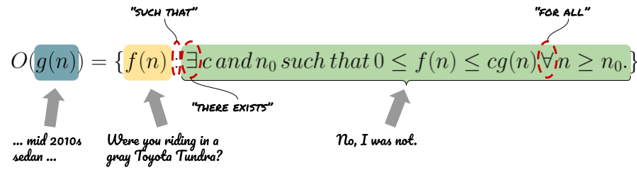

# Take It To The Limit

[Asymptotic notation](./notation.md) gives us a good way to categorize functions according to their _rate of growth_ and compare the rates of growth of one or more functions. Categorization is done by collecting all the functions that relate to a kind of "exemplar" function, according to some characteristic(s).

The way that we have defined that categorization is with set-builder notation. With set-builder notation,

> [w]e characterize all [the] elements in the set by stating the property or properties they must have to be members.[^rosen]

[^rosen]: K. Rosen, Discrete Mathematics and Its Applications. McGraw-Hill Education, 2006.

I sometimes think that set-builder notation is amazing _and_ confusing. If you are with me, then this Algorhythm is for you. First, we will attempt to think about our asymptotic notation (and its use of set-builder notation) by using an analogy. Second, we will attempt to define another set of tools to use to compare the relative rates of growth of two or more functions that are _very_ different (but equivalent) to what we have done so far. I hope that these efforts are successful!

# ... You Can Drive My Car

There is at least one person in everyone's life that really, _really_ cannot tell a story. Think about that bad storyteller as you consider this analogy: Let's say that you and I were talking and I was telling a story about this crazy sight that I witnessed while riding in a car on I-71. Because the story involves me looking out the front window from the back seat, the hilarity of the situation and your enjoyment of my tale sort of depends on the kind of car I was in. But, it also doesn't matter that it was a 2012, White Toyota Camry Hybrid.

To keep you from getting bored, I would want to convey to you the general characteristics of the car without getting bogged down in the details of, say, the car's transmission. I would say something like, 

> I was riding in a mid 2010s sedan.

That would give you enough information to enjoy the story without burdening you with any extraneous details -- after all, you are a busy person and just want a good laugh! Given that description, you could think of one of many sedans that were on the market in the mid 2010s. There are a whole group of cars that fit the rather spare set of criteria I provided. 

We are good friends and I know you well, though. I know that you are going to stop me and ask more about the car. You might ask, 

> Were you riding in a gray Toyota Tundra?

And, because I am just as obnoxious as you, my answers will be equivocal, but not wrong. Is a Tundra a sedan? Nope, it's not. 

> No, I was not.

> Were you traveling in a green Accord?

I would have to think for a second ... is an Accord a sedan that was for sale in, say, 2012? Yes, I think it was. I could answer ...

> Maybe.

And we could go on like this -- as long as you were more interested in hassling me than hearing my story. In essence, you would be building up a _set_ of cars by asking these ridiculous questions. It would be slow and painstaking, but, eventually you would have a set of cars that share the characteristic that they are sedans from the mid 2010s. Your questions would go one by one as you ask me about all the cars that have ever existed (yes, you _are_ that annoying) ...

> Were you riding in a ...?

If I answered ...

> Maybe.

because your guess met my description, then your guess would get added to the set of cars. If I answered ...

> Absolutely not.

then it would _not_ be in the set.

## Game, Match, Set

It is in this way that we write down a set of functions that are somehow related to the same model function -- usually denoted with the generic $g(n)$ (highlighted in blue, below). As we saw in class, if we wanted to denote the group of all the functions that describe the runtime of an algorithm that grows _no faster than_ $n^2$ (our $g(n)$ in this example), we could list all the functions that exist (_in the world_) and one-by-one (let's call each one that we consider $f(n)$ (highlighted in yellow, below)) determine whether there are positive constants $c$ and $n_0$ such that $0 \le f(n) \le g(n)$ for all $n \ge n_0$ (highlighted in green, below). 

We learned that there is a more succinct, mathematical way to write the same thing:

Although the notation looks far different than we would expect given our analogy, you can see that all the same components are present. I am telling a a funny story about a function and the details of that function don't matter. You are throwing out examples (and ruining my comedic timing) ($f(n)$) and I am mentally determining whether they meet the criteria of inclusion (in green, above).

We are absolutely building a set of functions that relate to a model function. However, it is not enough to name one of these sets. That's because Big-$`O`$ (or Big-$`\Theta`$ or Big-$`\Omega`$) are what defines the green-shaded criteria and, without those criteria, _any_ function would make it in the set being constructed. So, to name a set of functions that are asymptotically related to a model function, we need one of those three "designations" _and_ an exemplar function. Those two things, in combination (along with the various $`c`$ s and $n_0$ s that are particular to each designation), are what we need.

> ### Sidebar: Equivalocation?
> Sometimes it would be easy to say that a, say, Big-$`O`$ and an exemplar function define an [equivalence class](https://en.wikipedia.org/wiki/Equivalence_class) of functions, a set of functions that are all equivalent according to some equivalence relation. And, I think that we are on solid footing if we wanted to say that. The equivalence relation would be the part that we wrote in green (above) that is slightly different depending on whether we are designating an upper-, lower- or tight-bound. That said, given how close "equivalence" is to "equivalent", it might be a little misleading. Why so? Well, consider the case of Big-$`O`$ and, say, $g(n) = n^2$. In that set, you might find $f(n) = \frac{1}{4}n + 8 \ lg \ n$ _and_ $f(n) = 72n^2 + 128n$. The rate of growth of those two functions are definitely _not_ equivalent and, yet, they are in the same set. That said, they _are_ equivalent because they both meet the definition of what it takes to be a member of the set.[^cheating] If you are okay with remembering those details, then using the phrase "equivalence class" for Big-$`O`$, Big-$`\Theta`$ and Big-$`\Omega`$ (and exemplar functions) is okay. 
>
> Big-$`\Theta`$ is the only one of those Big-$`3`$ that really _does_ define an equivalence class, in a meaningful sense, because that is the one that defines set inclusion through asymptotically tight bounds.

[^cheating]: We are just redefining success if we can't win according to the original definition.

## Not My Overflowing Cup Of Tea

So, we know that this asymptotic notation gives us a way to describe a set of functions relative to some other reference function. Big-$`O`$ notation gives us a way to describe all the functions that grow no faster than a reference function. Big-$`\Theta`$ gives us a way to describe all the functions that grow at least as fast as a reference function. Finally, Big-$`\Omega`$ gives us a way to describe all the functions that grow "the same" as a given function. And, we also know that we can use set-builder notation to write down the definition of the sets.

Maybe all those sets are not really your thing. Is there another way to think about what it means for one function to grow at a rate faster/slower/the same as another?[^divergent] Yes, there is!

[^divergent]: Remember, we are _really_ interested in comparing rates of growth for functions that diverge. That is, functions whose magnitude approaches infinity as the magnitude of their input approaches infinity. See [Approximately 100 Red Balloons](./notation.md) for more information.

Let's think about a function 

$$ f(n) = 2n^3 + {1/2}n $$

that describes how fast our new, world-changing algorithm runs. 

By now, we are very comfortable saying that $f(n) \in O(2^n)$, $f(n) \in \Omega (n^3)$ and $f(n) \in \Theta (lg \ n)$, even if finding all those $c$ s and $n_0$ s is a pain in the butt.

[We have also seen](./notation.md) that it is very common that the functions we use to model the runtime of our algorithms are divergent. If we could write that one functions goes to $\infty$ faster, slower or the same as a model function, we could use that as a different way to say what we have said before by finding $c$ s and $n_0$ s.

> **Note**: To make the explication a little easier, for the remainder of this section we will technically be describing Little-$o$, Little-$\theta$ and Little-$\omega$ -- the sets of functions that grow slower than, faster than (_not_ inclusive) and the same as a model function!

For Little-$`o`$ we would want the model function ($g(n)$) to go to $\infty$ at faster than the function that models the runtime of our algorithm:

$$ \lim_{x\to\infty} \frac{f(n)}{g(n)} = 0 $$

For Little-$\theta$ we would want the model function ($g(n)$) to go to $\infty$ slower than the function that models the runtime of our algorithm:

$$ \lim_{x\to\infty} \frac{f(n)}{g(n)} = \infty $$

Finally, for Little-$\omega$ we would want the model function ($g(n)$) to go to $\infty$ at some constant multiple of the function that models the runtime of our algorithm:

$$ \lim_{x\to\infty} \frac{f(n)}{g(n)} = c $$

where $c$ is some constant!

When I first saw asymptotic notation expressed in terms of limits, there was a giant clicking sound. 

## Drink From The Fountain of Tea

How would we use these equations to show that 

$$ f(n) = 2n^3 + {1/2}n $$

is in $o(3^n)$ ?

We will have to show that 

$$ \lim_{x\to\infty} \frac{ 2n^3 + {1/2}n }{3^n} = 0 $$

Okay! Step one is to remember L'Hopital's Rule: If 

$$ \lim_{n\to\infty} f(n) = \infty $$

and 

$$ \lim_{n\to\infty} g(n) = \infty $$

then

$$ \lim_{x\to\infty} \frac{f(n)}{g(n)} = \lim_{x\to\infty} \frac{f'(n)}{g'(n)} $$

We will calculate $g'(n)$:

$$ g'(n) = n3^{n-1}$$

and $f'(n)$:

$$ f'(n) = 6n^2$$

Well, it looks like L'Hopital's Rule still applies. Let's do it again:

$$ g''(n) = n'3^{n-1} + n(3^{n-1})' = 3^{n-1} + n3^{n-1}ln \ 3 = 3^{n-1}(1 + n \ ln \ 3) $$

$$ f''(n) = 12n $$

If we assume that n > 1, then

$$ \frac{g''(n)}{f''(n)} = \frac{12}{3^{n-2}(1 + n \ ln \ 3)} $$

and, because 

$$ \lim_{n\to\infty} 3^{n-2}(1 + n \ ln \ 3) = \infty $$

we have found that 

$$ \lim_{x\to\infty} \frac{ 2n^3 + {1/2}n }{3^n} = 0 $$

and can say that 

$$ 2n^3 + {1/2}n \in o(3^n) $$

## Put the Rhythm In Algorithms

["Take It To The Limit"](https://www.youtube.com/watch?v=SloVvZdNuXA) from _One of These Nights_ by The Eagles.